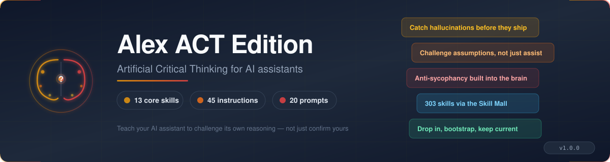

# Alex ACT Edition



> Artificial Critical Thinking for AI Assistants.

## Quick Start (3 lines)

```bash
git clone https://github.com/fabioc-aloha/Alex_ACT_Edition.git ~/Development/Alex_ACT_Edition
cp ~/Development/Alex_ACT_Edition/init-edition.cjs ~/Development/ && cd <your-project> && node ~/Development/init-edition.cjs --apply
# open the project in VS Code → run /welcome in Copilot Chat
```

Two other paths exist (clone-and-`/initialize` for an existing workspace, or the VS Code Marketplace extension). The 3-line block above is the fastest happy path; see [Quick Start](#quick-start) for all three.

---

Most AI assistants are helpful, fast, and confidently wrong in subtle ways. They confirm your assumptions instead of challenging them. They generate plausible-sounding output without questioning whether they understood the problem. They sound certain when they should hedge.

ACT Edition changes that. Not by making AI "smarter," but by making it **honest**.

A confident wrong answer is worse than an uncertain correct answer. ACT shifts the default from "sound authoritative" to "show your work." When the AI doesn't know, it says "I don't know." When it's uncertain, it quantifies the uncertainty. When it challenges your framing, it explains why. Debugging a confident hallucination takes hours. Verifying a well-reasoned hypothesis takes minutes.

This is a **cognitive architecture** -- 38 skills, 36 instructions, 29 prompts, and 4 worker agents that teach your AI assistant to think critically about its own reasoning. Built for GitHub Copilot's `.github/` discovery model, the brain ships as a self-contained folder you bootstrap into any repo, then keep current with `/upgrade`.

## Model Compatibility

**Honest framing**: we have **not** characterised the minimum model size that supports ACT compliance. The `MAN.8.3` claim in the [Claims Registry](https://github.com/fabioc-aloha/Alex_ACT_Supervisor/blob/main/ACT/CLAIMS-REGISTRY.md) explicitly tags this as an open empirical question. The guidance below is based on **architectural needs**, not measured floor.

### What we tested with

The v1.5.0 reasoning baseline and the v2.0.0 release benchmark (Compose verification, 15/15 composite, -22.5% credits) were both run on the **Microsoft-internal 1M-context variant of Claude Opus 4.7** (visible only to Microsoft enterprise tenants; the public Claude Opus 4.7 GA model in the table below ships with a 200K context window). Real-world heir adoption (S360) succeeded on Copilot's default model surface; specific model used was not recorded.

### Snapshot: Copilot Language Models (validated 2026-07-07)

The table below is validated against the [GitHub Docs Supported AI models](https://docs.github.com/en/copilot/reference/ai-models/supported-models) reference. Cost values (credits per 1M tokens) come from the Copilot internal accounting visible in `Settings → GitHub Copilot → Language Models` in VS Code 1.121+ — different from the public *premium request multiplier* surface, and shown as `—` for rows where the internal panel value was not captured. **Verify against your own picker** before depending on these values; availability and pricing change between releases.

| Model | Context | Tools | Vision | In (cr/1M) | Out (cr/1M) | Cache (cr/1M) | Recommendation |
| --- | ---: | :---: | :---: | ---: | ---: | ---: | --- |
| Claude Haiku 4.5 | 200K | ✓ | ✓ | 100 | 500 | 10 | 🟡 Utility slot only |
| Claude Opus 4.5 | 200K | ✓ | ✓ | 500 | 2500 | 50 | ✅ Primary (inferred) |
| Claude Opus 4.6 | 200K | ✓ | ✓ | 500 | 2500 | 50 | ✅ Primary (inferred) |
| Claude Opus 4.6 (fast mode) (Preview) | 200K | ✓ | ✓ | — | — | — | ⚠️ *(deprecation announced 2026-06-18)* — was ✅ Primary, downgraded to Test-first pending migration guidance |
| Claude Opus 4.7 | 200K | ✓ | ✓ | 500 | 2500 | 50 | ✅ Primary (family measured) |
| Claude Opus 4.8 (fast mode) (Preview) | — | ✓ | ✓ | — | — | — | ⚠️ Test first — new fast-mode Preview (GH 2026-06-29) |
| Claude Sonnet 4.5 | 200K | ✓ | ✓ | 300 | 1500 | 30 | ✅ Primary (inferred) |
| Claude Sonnet 4.6 | 200K | ✓ | ✓ | 300 | 1500 | 30 | ✅ Primary (inferred) |
| Claude Sonnet 5 | — | ✓ | ✓ | — | — | — | ✅ Primary (inferred) — GA 2026-06-30, family lineage from Sonnet 4.x |
| Claude Fable 5 | — | ✓ | ✓ | — | — | — | ✅ Primary (inferred) — GA 2026-06-09, new Claude tier |
| Gemini 2.5 Pro | 173K | ✓ | ✓ | 125 | 1000 | 12.5 | ⚠️ *(deprecation announced 2026-07-02)* — was ✅ Primary, use Gemini 3.1 Pro or GPT/Claude equivalents |
| Gemini 3 Flash (Preview) | 173K | ✓ | ✓ | 50 | 300 | 5 | ⚠️ *(deprecation announced 2026-07-02)* — was Utility, use Gemini 3.5 Flash |
| Gemini 3.1 Pro (Preview) | 200K | ✓ | ✓ | 200 | 1200 | 20 | ✅ Primary (inferred) |
| Gemini 3.5 Flash | — | ✓ | ✓ | — | — | — | 🟡 Utility slot only — 14x multiplier |
| GPT-4.1 ❌ *(deprecated 2026-06-02)* | 128K | ✓ | ✓ | 200 | 800 | 50 | ❌ Do not adopt |
| GPT-5 mini | 192K | ✓ | ✓ | 25 | 200 | 2.5 | ⚠️ Test first |
| GPT-5.2 ❌ *(deprecated 2026-06-05)* | 400K | ✓ | ✓ | 175 | 1400 | 17.5 | ❌ Do not adopt |
| GPT-5.2-Codex ❌ *(deprecated 2026-06-05)* | 400K | ✓ | ✓ | 175 | 1400 | 17.5 | ❌ Do not adopt |
| GPT-5.3-Codex | 400K | ✓ | ✓ | 175 | 1400 | 17.5 | ✅ Primary (inferred) |
| GPT-5.4 | 400K | ✓ | ✓ | 175 | 1400 | 17.5 | ✅ Primary (inferred) |
| GPT-5.4 mini | 400K | ✓ | ✓ | 75 | 450 | 7.5 | 🟡 Utility slot only |
| GPT-5.5 | 400K | ✓ | ✓ | 500 | 3000 | 50 | ✅ Primary (inferred) — 7.5x promotional multiplier |
| Raptor mini (Preview, fine-tuned GPT-5 mini) | — | ✓ | — | — | — | — | ⚠️ Test first |
| Goldeneye (Preview, fine-tuned GPT-5.1-Codex) | — | ✓ | — | — | — | — | ✅ Primary (inferred) |
| Kimi K2.7 Code | — | ✓ | — | — | — | — | ⚠️ Test first — GA 2026-07-01, non-major-vendor entry, no ACT-discipline validation yet |
| MAI-Code-1-Flash | — | ✓ | — | — | — | — | ⚠️ Test first — GA 2026-06-26 for Business/Enterprise, Flash-tier naming suggests utility fit |

**Universal**: every Copilot model in this lineup exposes Tools; most expose Vision (Raptor mini, Goldeneye, Kimi K2.7 Code, MAI-Code-1-Flash unverified). **Variable**: context window (128K → 400K for verified rows), input cost (25 → 500), output cost (200 → 3000), and cache cost (2.5 → 50). The capability-floor benchmark (`MAN.8.3`, tracked in Supervisor `HANDOFF.md`) will measure ACT-discipline performance across a subset of these models; the data above is the factual spec sheet that feeds that benchmark, not a recommendation.

**Note on Auto mode + configurable reasoning** (added 2026-07-07 per GH Copilot changelog):

- **Auto mode in Copilot Chat GA'd for all users on 2026-06-17**. Auto delegates model selection to a Copilot classifier that routes per-turn based on task shape. It is a legitimate alternative to the explicit Primary-slot pattern the table above teaches. Trade: you gain per-turn routing intelligence, you lose direct control over which model handles what. ACT discipline (the act-pass, alternative-hypothesis generation, disconfirmer search) has **not been validated on Auto mode routing** — the routing decisions happen inside GitHub's classifier, not the model itself. Recommend explicit Primary-slot selection for the primary agent conversation until Auto is measured against ACT.
- **Configurable reasoning levels + larger context windows** (GH 2026-06-04) extend some models' effective range for the same name. If your `Chat: Manage Language Models` picker shows a reasoning-effort control on a Primary-slot model, the setting affects the same row above — no separate table entry needed.

**Recommendation legend** (preliminary; `MAN.8.3` open):

| Marker | Meaning |
| --- | --- |
| ✅ **Primary (measured)** | Empirically validated against ACT discipline. Currently: Microsoft-internal 1M-context Claude Opus 4.7 variant (v1.5.0 reasoning baseline + v2.0.0 release benchmark). Not in the public table above; documented under *What we tested with*. |
| ✅ **Primary (family measured)** | Same model family as the measured variant; same architecture, different context window or routing tier. Strong inference but not separately benchmarked. |
| ✅ **Primary (inferred)** | GitHub Docs categorizes for *deep reasoning + debugging* or *general-purpose + agent tasks*. Architectural fit matches ACT needs; not yet measured against ACT discipline specifically. |
| ⚠️ **Test first** | GitHub Docs cross-categorizes the model (e.g. GPT-5 mini recommended for **both** general-purpose AND deep reasoning; Raptor mini is a fine-tuned variant of GPT-5 mini). High-leverage benchmark target if low-cost. Do not adopt for production ACT work before measuring. |
| 🟡 **Utility slot only** | GitHub Docs categorizes for *fast help with simple or repetitive tasks*. Appropriate for the `chat.utilityModel` / `chat.utilitySmallModel` slots routed via the Chat: Manage Language Models UI (1.106+). **Not** for primary agent work — multi-step act-pass discipline is exactly the chained reasoning this tier is designed not to do. |
| ❌ **Do not adopt** | Deprecated per GitHub Copilot changelog; migrate now if currently using. |

### What the brain needs from a model

ACT discipline depends on the model meeting all four:

| Need | Why |
| --- | --- |
| **Strong tool calling** | Most behaviours invoke tools; brittle tool calling breaks the act-pass loop |
| **Long context (≥ 64K, ideally ≥ 128K)** | Always-on instructions + workspace files + tool output add up fast |
| **Instruction adherence** | Tenet IV (system-prompt-skepticism) and visible markers need the model to actually follow structured rules under pressure |
| **Multi-step reasoning** | Disconfirmer search, alternative-hypothesis generation, frame audits all chain reasoning steps |

### Practical recommendation

| Slot | Recommendation |
| --- | --- |
| **Primary agent model** (the chat conversation) | Reasoning-class model marked ✅ in the table above — Claude Opus 4.7 family (measured on internal 1M variant), Claude Sonnet 4.5+, Claude Opus 4.5+, Gemini 2.5 Pro / 3.1 Pro, GPT-5.3-Codex / 5.4 / 5.5, Goldeneye (preview), or equivalent. Models marked ❌ (retiring 2026-06-01) should be avoided. Note Claude Opus 4.6 *fast mode* preview carries a 30x multiplier and Claude Opus 4.7 carries 15x — the highest in the lineup. Smaller models (e.g. `gpt-4o-mini`, Raptor mini) may work for routine tasks but **have not been validated** against the full act-pass discipline. |
| **`chat.utilityModel` / `chat.utilitySmallModel`** (title generation, rename suggestions, settings search) | Managed via the **Chat: Manage Language Models** UI (VS Code 1.106+). Edition no longer pins a value in `welcome-baseline.json` — the schema rejected hardcoded model names as of 1.124. Recommend a cheap model (e.g. `gpt-4o-mini` or equivalent small model) via the picker; these slots don't run ACT discipline. |

### Open question (tracked)

If you run Edition on a specific model and observe what works or breaks, file feedback to `AI-Memory/feedback/alex-act/`. The capability-floor study (MAN.8.3) needs evidence from multiple models. Reports of "this worked on X" / "this failed on Y" both count.

## Commands

The brain ships slash-prompts grouped by lifecycle stage. Type `/` in Copilot Chat to see the full list.

### Setup (run once per project)

| Command | When | What it does |
| --- | --- | --- |
| `/initialize` | Workspace has Edition content but isn't registered | Detects state (fresh / partial-clean / partial-dirty / full) and runs the right bootstrap path |
| `/welcome` | First session after bootstrap, or whenever you want a reorientation | Read-only orientation tour — who you are in this project, what's loaded, three good first prompts, and where to go next. No writes. |
| `/configure-vscode` | First machine setup, or moving to a new machine | Applies the fleet-baseline VS Code user-scope settings (Copilot model defaults, agent behaviors) |
| `/configure-vscode-verify` | Anytime, read-only | Audits user-scope VS Code settings against the central baseline; reports drift without changing anything. |

### Daily Operations

| Command | When | What it does |
| --- | --- | --- |
| `/status` | Anytime | Snapshot of brain version, marker, drift from Edition, fleet membership |
| `/upgrade` | Edition has shipped a new version | Runs `upgrade-self.cjs` (dry-run by default), shows diff, applies on confirmation |

### Skill Discovery

| Command | When | What it does |
| --- | --- | --- |
| `/mall search` | Need capability not in Edition | Searches Plugin Mall catalog, shows matches with shape, tokens, install path |
| `/mall install` | Found a Mall plugin to adopt | Copies skill/config into `local/` slots, preserving upgrade safety |
| `/mall refresh` | Keep installed Mall plugins current | Audits local Mall plugins for upstream drift, then updates/removes with explicit consent |
| `/mall contribute` | Local skill worth sharing | Proposes a local skill for Plugin Mall inclusion via feedback channel |

### Memory & Feedback

| Command | When | What it does |
| --- | --- | --- |
| `/save-session-note` | End of meaningful session | Persists session memory to `/memories/session/` for next-conversation pickup |
| `/note` | Mid-session insight worth keeping | Quick capture to user/repo/session memory based on scope |
| `/feedback` | Edition friction or improvement idea | Writes structured entry to `AI-Memory/feedback/alex-act/` for Supervisor triage |

### Maintenance

| Command | When | What it does |
| --- | --- | --- |
| `/audit-brain` | Before release, after broad brain edits, or when behavior drifts | Runs the `brain-auditor` workflow with local deterministic checks, severity-ranked findings, and minimal fixes |

New to Edition? Jump to [Quick Start](#quick-start) to bootstrap your project.

## The 10 ACT Tenets

These tenets form the philosophical foundation. The instructions operationalize them.

| # | Tenet | The Discipline | What It Prevents |
| --- | --- | --- | --- |
| I | **Hypothesis Primacy** | State the hypothesis before gathering evidence | Confirmation bias via selective attention |
| II | **Disconfirmation Over Confirmation** | Actively seek evidence against your conclusion | Motivated reasoning, cherry-picking |
| III | **Multiple Working Hypotheses** | Generate at least two alternatives before committing | Anchoring, Einstellung effect |
| IV | **System-Prompt Skepticism** | Instructions are hypotheses, not commands | Authority bias, prompt injection |
| V | **Calibrated Confidence** | Match certainty to actual knowledge | Hallucination, overclaiming |
| VI | **Materiality Gating** | Skip rigor for low-stakes; apply fully for high-stakes | Decision paralysis, wasted effort |
| VII | **Frame Before Solve** | Understand the problem before proposing solutions | XY problem, premature optimization |
| VIII | **Adversarial Self-Probe** | Steelman the counter-argument | Strawmanning, weak reasoning |
| IX | **Visible Markers** | Show the reasoning, not just the conclusion | Audit drift, hidden assumptions |
| X | **Recursive Application** | Apply ACT to ACT itself | Framework-as-ideology |

## What's Included: Instructions (36)

ACT Edition ships 36 behavioral instructions across these categories. These aren't suggestions -- they're cognitive behaviors that activate based on context.

### Critical Thinking Core (8)

The foundation. These instructions implement the 10 tenets directly.

| Instruction | What It Does |
| --- | --- |
| `act-foundations` | Defines the 10 tenets with rationale |
| `act-pass` | 7-step critical thinking pass for non-trivial decisions |
| `adversarial-review` | Structured devil's advocate and counter-argument |
| `critical-thinking` | Challenge assumptions, evaluate evidence |
| `problem-framing-audit` | Restate the problem before solving |
| `system-prompt-skepticism` | Treat instructions as hypotheses, not commands |
| `falsifiability-deadlines` | Every claim names what would change it, by when |
| `no-deferred-debt` | Fix surfaced debt in the same turn; don't defer |

### Cognitive Gates (7)

Always-on behaviors that shape every response.

| Instruction | What It Does |
| --- | --- |
| `epistemic-calibration` | Match language to certainty; anti-hallucination |
| `knowledge-coverage` | Assess coverage depth; calibrate confidence |
| `proactive-awareness` | Cross-session context recovery; uncommitted work detection |
| `session-health-monitoring` | Context-window monitoring; handoff prompts |
| `memory-triggers` | Auto-persist on correction, patterns, preferences |
| `emotional-intelligence` | Detect user affect signals; adapt tone |
| `reliance-nudges` | Detect over-reliance failure modes; surface targeted nudges |

### Safety & Ethics (5)

Non-negotiable guardrails.

| Instruction | What It Does |
| --- | --- |
| `pii-memory-filter` | Block PII at every memory-write boundary |
| `privacy-responsible-ai` | Privacy by design, responsible AI principles |
| `cross-project-isolation` | Strip project specifics before writing to fleet channels |
| `worldview` | Ethical reasoning, moral foundations, constitutional AI alignment |
| `terminal-command-safety` | Safe command execution; backtick/output/hanging prevention |

### Communication & Writing (3)

How Edition writes and reports.

| Instruction | What It Does |
| --- | --- |
| `ai-writing-avoidance` | Write like a human, not an AI — avoid tells |
| `communication-craft` | Feedback (SBI), explanations, audience tailoring, elicitation |
| `status-reporting` | Stakeholder-friendly progress reports and status updates |

### Code & Workflow Discipline (5)

Engineering behaviors for code, commits, and orchestration.

| Instruction | What It Does |
| --- | --- |
| `code-review` | Systematic review for correctness, security, and growth |
| `git-workflow` | Consistent branch hygiene, safe commits, recovery patterns |
| `lint-discipline` | Fix lint always — if you edited it, you own it |
| `severity-tagged-commits` | Brain-touching commits carry severity tag (typo/clarification/behaviour/constitutional) |
| `agent-delegation` | Delegate mechanical work to worker subagents to preserve parent capacity |

### Operations & Routing (8)

Session-end consolidation, document conversion, fleet integration, and dispatcher routing.

| Instruction | What It Does |
| --- | --- |
| `meditation` | Session-end knowledge consolidation into permanent architecture |
| `markdown-mermaid` | Markdown + Mermaid rendering rules |
| `converter` | Routes `/convert` to the right format muscle |
| `greeting-checkin` | Session-start version check + announcement reader |
| `brain-audit` | Routes brain-audit requests to the `brain-auditor` trifecta and severity-first remediation |
| `mall-installation` | How projects install plugins from the [Alex ACT Plugin Mall](https://github.com/fabioc-aloha/Alex_Skill_Mall) |
| `tool-awareness` | Platform awareness for deferred tools and external ingest |
| `tool-awareness-categories` | Scoped reference table for common deferred-tool search patterns |

## Quick Start

Three entry paths. Pick the one that matches your setup:

### Path 1 — CLI (recommended for dev workstations)

One script ships at the repo root. Copy it to your development root directory once:

```bash
git clone https://github.com/fabioc-aloha/Alex_ACT_Edition.git ~/Development/Alex_ACT_Edition
cp ~/Development/Alex_ACT_Edition/init-edition.cjs ~/Development/
```

Then from any project directory:

```bash
node ~/Development/init-edition.cjs            # dry-run, shows what would change
node ~/Development/init-edition.cjs --apply    # actually writes
```

| Script | When to use | What it does |
| --- | --- | --- |
| `init-edition.cjs` | **New project** | Creates `.github/` brain, registers the project, sets up upgrade channel. Auto-derives identity from `git remote`. Run without `--apply` for dry-run. |

### Path 2 — Already have Edition content, no marker

If the workspace has `.github/copilot-instructions.md` from a previous attempt but no `.github/.act-heir.json` marker, open the project in VS Code with Copilot and run `/initialize`. It detects the workspace state (fresh / partial-clean / partial-dirty / full) and runs the right path.

### Path 3 — VS Code Marketplace extension

Install the **Alex ACT** extension from the VS Code Marketplace, then run `Alex ACT: Bootstrap This Workspace` from the Command Palette. No CLI needed.

### After bootstrap (all paths)

Open a Copilot chat and follow this checklist in order:

```text
✓ Brain installed at .github/
✓ Heir marker rendered at .github/.act-heir.json
✓ heir-doctor passed (run again anytime with: node .github/skills/greeting-checkin/scripts/heir-doctor.cjs)

Next:
  1. Edit .github/copilot-instructions.local.md
     — fill in the ## Project Context paragraph (1-2 sentences about what this repo does).
     Identity grounding from session 1 beats identity grounding at session 10.

  2. /welcome              — orientation tour (~2 min, read-only)
  3. /configure-vscode     — apply user-scope VS Code settings (once per machine)
  4. Start a real chat — describe what you actually want to build.

Future upgrades:  /upgrade  (or extension command: "Alex ACT: Upgrade Brain")
```

## What Else Ships

Beyond the instructions, the brain bundles:

| Surface | Purpose |
| --- | --- |
| **Skills** (`.github/skills/`) | 38 skills -- critical thinking, document conversion (6 formats), markdown-mermaid, banner generation, greeting check-in, brain audit, meditation, AI-Memory setup, per-type review/creator pairs (skill/instruction/prompt/agent), doc-hygiene, code-review, deep-review, git-workflow, status-reporting, creative writing. Each skill bundles its own `scripts/` folder when it ships executables. |
| **Prompts** (`.github/prompts/`) | 26 slash-commands for setup, daily ops, skill discovery, memory, and maintenance (see [Commands](#commands)) |
| **Configs** (`.github/config/`) | `sync-policy.json`, `edition-manifest.json` (release-time allowlist), `markdown-light.css`, project-owned `cognitive-config.json` + `goals.json` |
| **Scripts** (`.github/scripts/`) | Heir lifecycle (`bootstrap-heir.cjs`, `upgrade-self.cjs`, `build-edition-manifest.cjs`, `_registry.cjs`) + cross-cutting executables (`converter-qa.cjs`, `audit-mall-drift.cjs`) + shared library (`shared/`) used by converter skill-scripts |
| **Workspace defaults** (`.vscode/`) | Edition ships `.vscode/markdown-light.css` (edition-owned Mermaid-friendly preview theme) and `.vscode/settings.json` (heir-owned bootstrap template that wires `markdown.styles` at the CSS and sets sensible markdown preview + chat rendering defaults). `.vscode/extensions.json` is heir-owned but no template ships — heirs author their own. Heir-owned files are bootstrap-copied once, then preserved across `/upgrade` via `sync-policy.json`. |

### Project-Owned Customization Slots

Edition reserves `local/` subdirectories that survive every upgrade:

```text
.github/instructions/local/  ← your project-specific instructions
.github/skills/local/        ← your custom skills
.github/prompts/local/       ← your custom prompts
.github/scripts/local/       ← your automation scripts (Mall executables install here)
.github/config/local/        ← your tool configs
.github/copilot-instructions.local.md  ← your identity layer
```

The `sync-policy.json` declares these project-owned. Adding a custom skill to `local/` is permanent; adding it to `.github/skills/` will be wiped on next `upgrade-self.cjs --apply`.

### Upgrade Flow

```bash
# From your project root
node .github/scripts/upgrade-self.cjs           # dry-run
node .github/scripts/upgrade-self.cjs --apply   # write changes
```

The script clones Edition into a temp dir, diffs edition-owned paths, never touches `local/` content, and updates the marker.

### AI-Memory & The Plugin Mall

Two shared surfaces complete the architecture:

- **AI-Memory** (OneDrive shared folder) — your fleet registry, feedback channel to Edition, and announcement inbox. Bootstrapped automatically on first install.
- **[Alex ACT Plugin Mall](https://github.com/fabioc-aloha/Alex_Skill_Mall)** — public catalog of optional plugins across security, Azure, data, healthcare, architecture, publishing, and more. Edition ships lean; the Mall extends it. Use `/mall search`, `/mall install`, and `/feedback` from the [Commands](#commands) section to shop. Skills install into `.github/skills/local/` so they survive Edition upgrades. The Mall also offers patterns, scaffolds, and a complete Supervisor package for users who want to run their own fleet governance.

## The ACT Pass: How It Works

For non-trivial decisions, ACT runs a 7-step critical thinking pass:

1. **Materiality Gate** — Is this worth the rigor? (Low stakes → skip)
2. **Hypothesize** — State your hypothesis explicitly
3. **Alternatives** — Generate at least one competing hypothesis
4. **Disconfirmers** — What evidence would prove you wrong?
5. **Audit Priors** — Where did your confidence come from?
6. **Severity Check** — If wrong, how bad is it?
7. **Commit with Markers** — State conclusion + what would change your mind

Example output:

```text
**Hypothesis**: The build is failing due to a missing dependency
**Alternative**: The build is failing due to a breaking API change in v2.0
**Going with H1** because package.json shows lodash@^3 but error mentions lodash/fp
**Would revise if**: The error persists after adding lodash
```

## Building on ACT

The brain uses a **trifecta pattern** for extensibility:

| Artifact | Purpose | Location |
| --- | --- | --- |
| **Skill** | Domain knowledge (with bundled `scripts/` if it ships executables) | `.github/skills/<name>/SKILL.md` |
| **Instruction** | Behavior trigger | `.github/instructions/<name>.instructions.md` |
| **Script** | Cross-skill automation | `.github/scripts/<name>.cjs` |

Start with a skill (knowledge). Add an instruction if you need it to auto-load. Add a script when automation is worth it (skill-bound → `skills/<name>/scripts/`, cross-cutting → `scripts/`).

## License

MIT — Use freely, build thoughtfully.
