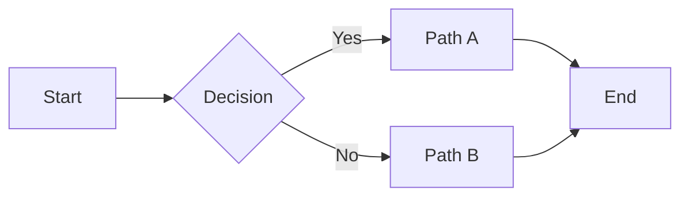
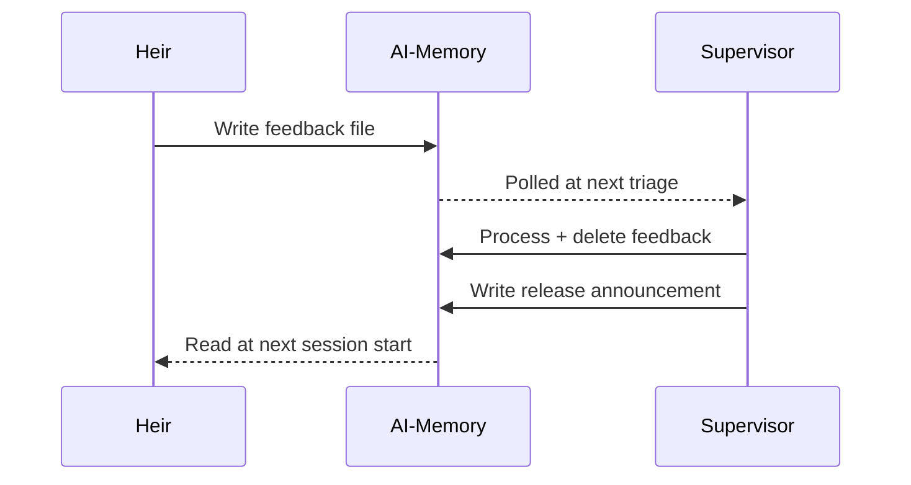
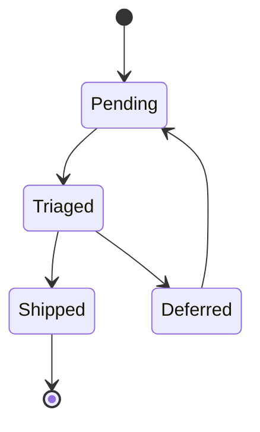
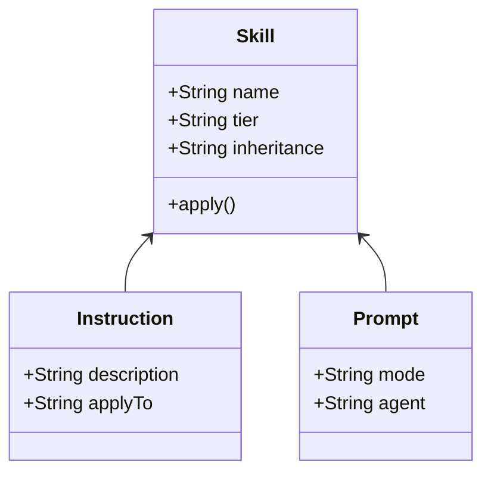

# md-to-word Coverage Smoke Test

Regression fixture for `md-to-word.cjs`. Exercises every markdown feature the skill claims to support so future converter changes have a single command to verify nothing regressed.

Run:

```bash
node .github/muscles/md-to-word.cjs docs/testing/md-to-word-coverage.md
```

Open the resulting `md-to-word-coverage.docx` and verify each section renders as described in its caption.

---

## Headings (H1 through H6)

The heading above is H2. H1 is the document title.

### Heading 3 — branded color

#### Heading 4

##### Heading 5

###### Heading 6

---

## Inline formatting

Plain text. **Bold text**. *Italic text*. ~~Strikethrough text~~. `inline code`. [Link to GitHub](https://github.com).

Combined: ***bold italic***. **`bold inline code`**. *[italic link](https://example.com)*.

A footnote reference[^1] should appear with a small superscript marker.

[^1]: This is the footnote body, rendered at the document end.

---

## Lists

### Bullet list (flat)

- First item
- Second item
- Third item

### Bullet list (nested 3 deep)

- Top item
  - Nested level 2
    - Nested level 3
  - Back to level 2
- Top item 2

### Numbered list

1. First step
2. Second step
3. Third step

### Numbered list (nested)

1. Parent step
   1. Child step
   2. Another child
2. Sibling parent

### Task list

- [ ] Unchecked task
- [x] Checked task
- [ ] Another unchecked
  - [x] Nested checked

---

## Tables

### Small table

| Column A | Column B |
| --- | --- |
| Cell 1 | Cell 2 |
| Cell 3 | Cell 4 |

### Wide table with alignment

| Left | Center | Right | Mixed Content |
| :--- | :---: | ---: | --- |
| left-aligned | centered | right-aligned | normal cell with **bold** and `code` |
| short | longer text in middle column | 123.45 | a longer phrase to test cell wrap behavior |
| row 3 | data | 7,890 | more data |

### Table that should test pagination (many rows)

| # | Item | Value | Notes |
| --- | --- | --- | --- |
| 1 | Alpha | 100 | First entry |
| 2 | Beta | 200 | Second entry |
| 3 | Gamma | 300 | Third entry |
| 4 | Delta | 400 | Fourth entry |
| 5 | Epsilon | 500 | Fifth entry |
| 6 | Zeta | 600 | Sixth entry |
| 7 | Eta | 700 | Seventh entry |
| 8 | Theta | 800 | Eighth entry |

---

## Code blocks

### Bash

```bash
#!/usr/bin/env bash
set -euo pipefail

echo "hello, world"
for f in *.md; do
  echo "Processing ${f}"
done
```

### JavaScript

```javascript
const greet = (name) => `Hello, ${name}!`;
console.log(greet('Edition'));
```

### Python

```python
def fibonacci(n: int) -> int:
    if n < 2:
        return n
    return fibonacci(n - 1) + fibonacci(n - 2)
```

### Plain (no language)

```text
plain code block with no syntax highlighting
preserves whitespace
    and indentation
```

---

## Blockquotes

Single-line example:

> A single-line blockquote.

Multi-line example:

> A multi-line blockquote
> that spans several lines
> with continuation.

Nested example:

> Nested blockquote test
> > Inner quoted content
> > > Even deeper

---

## Horizontal rule

Above this line.

---

Below this line.

---

## Images and diagrams

### PNG / JPG image reference

If a `images/sample.png` file exists in the same directory, this will render. Otherwise the converter logs a warning.


### Mermaid flowchart (left-right)



### Mermaid sequence diagram



### Mermaid state diagram



### Mermaid class diagram



---

## Verification checklist

After conversion, open the .docx and confirm:

| Feature | Expected | Pass? |
| --- | --- | --- |
| Document title appears as H1 (largest, branded color) | Yes | [ ] |
| H2-H6 form a clear visual hierarchy | Yes | [ ] |
| Bold, italic, strikethrough render correctly | Yes | [ ] |
| Inline code is monospace with subtle background | Yes | [ ] |
| Links are blue underlined | Yes | [ ] |
| Footnote `[^1]` renders as superscript marker, body at end of doc | Yes | [ ] |
| Bullet lists nest visually (indentation + marker change) | Yes | [ ] |
| Numbered lists count correctly through nesting | Yes | [ ] |
| Task lists show checkbox glyphs | Yes | [ ] |
| Tables: header row Microsoft blue + white text, **9pt** | Yes | [ ] |
| Tables: data cells **8.5pt**, zebra stripes (light gray on even rows) | Yes | [ ] |
| Tables: tight cell padding (1pt T/B, 3pt L/R) — rows feel compact | Yes | [ ] |
| Tables: header row repeats on second page (for the wide row table if it paginates) | Yes | [ ] |
| Code blocks: Consolas, gray background, left accent bar | Yes | [ ] |
| Code blocks don't split across pages | Yes | [ ] |
| Blockquotes: italic, gray left border | Yes | [ ] |
| Horizontal rule renders as light gray line | Yes | [ ] |
| Mermaid diagrams: rendered as crisp PNGs, centered, fit 90% page width | Yes | [ ] |
| **No table of contents** at the top (unless `--toc` was passed) | Yes | [ ] |
| Page numbers in footer (gray 9pt centered) | Yes | [ ] |

## TOC marker behavior test

This document does NOT contain `[toc]`. To test the warn-and-ignore behavior:

1. Add a single line `[toc]` near the top of this file
2. Run `node .github/muscles/md-to-word.cjs docs/testing/md-to-word-coverage.md`
3. Verify the console emits a warning: `[toc] marker found … but --toc was not passed; marker stripped, TOC not generated. Pass --toc to enable.`
4. Verify the output `.docx` has **no** Table of Contents
5. Re-run with `--toc` and verify TOC IS generated normally
6. Remove the `[toc]` line before committing
